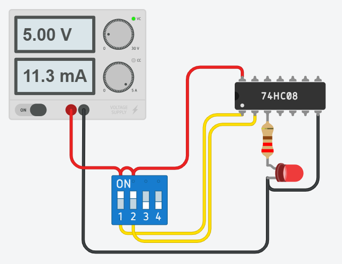
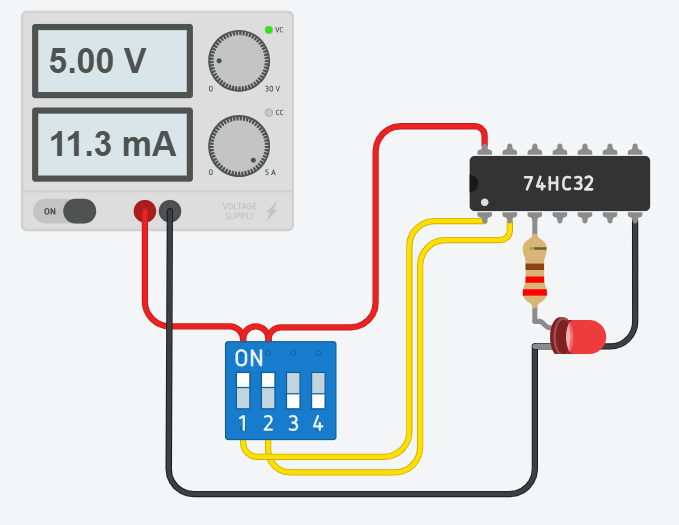
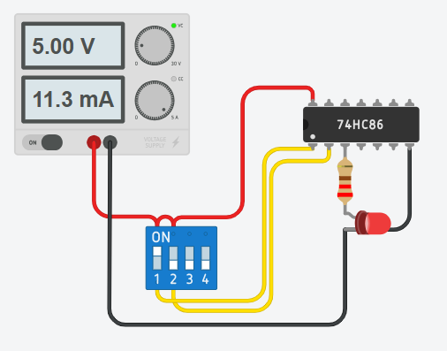
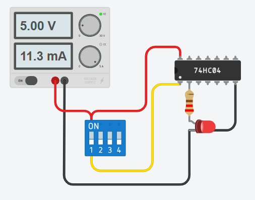

# TUGAS PRAKTIKUM PERTEMUAN 8

NAMA : - MUHAMMAD NAUFAL ANDRIANA PUTRA (H1H025065) - ILHAM CANIAGO (H1H025072) - RASHEED JIBRIL KURNIAWAN (H1H025XXX)

---

## 1. AND

Gerbang AND bekerja dengan aturan bahwa **semua input harus bernilai 1** agar output menjadi 1. Jika ada satu saja input bernilai 0, maka output langsung menjadi 0, tanpa memperhatikan nilai input lainnya.

### Tabel Kebenaran AND

| Input A | Input B | Output (A AND B) |
| :-----: | :-----: | :--------------: |
|    0    |    0    |        0         |
|    0    |    1    |        0         |
|    1    |    0    |        0         |
|    1    |    1    |        1         |

---

## 2. OR

Gerbang OR bekerja dengan prinsip yang lebih fleksibel dibanding AND. Output akan bernilai **1 jika minimal satu input bernilai 1**. Output hanya bernilai 0 ketika semua input bernilai 0 secara bersamaan.

### Tabel Kebenaran OR

| Input A | Input B | Output (A OR B) |
| :-----: | :-----: | :-------------: |
|    0    |    0    |        0        |
|    0    |    1    |        1        |
|    1    |    0    |        1        |
|    1    |    1    |        1        |

---

## 3. XOR

XOR (Exclusive OR) merupakan versi "eksklusif" dari OR. Output akan bernilai **1 hanya jika input memiliki nilai yang berbeda** atau tepat satu input bernilai 1. Jika kedua input sama (0 dan 0, atau 1 dan 1), maka output menjadi 0.

### Tabel Kebenaran XOR

| Input A | Input B | Output (A XOR B) |
| :-----: | :-----: | :--------------: |
|    0    |    0    |        0         |
|    0    |    1    |        1         |
|    1    |    0    |        1         |
|    1    |    1    |        0         |

---

## 4. NOT

Gerbang NOT adalah gerbang logika paling sederhana karena hanya memiliki **satu input dan satu output**. Fungsinya sebagai pembalik nilai (inverter): jika input bernilai 1 maka output menjadi 0, dan jika input bernilai 0 maka output menjadi 1.

### Tabel Kebenaran NOT

| Input A | Output (NOT A) |
| :-----: | :------------: |
|    0    |       1        |
|    1    |       0        |

---

## 5. NAND

Gerbang NAND adalah gerbang yang menghasilkan kebalikan dari gerbang AND. Gerbang ini akan menghasilkan output 0 (LOW) hanya **jika semua inputnya bernilai 1 (HIGH)**. Jika ada salah satu saja input yang bernilai 0, maka outputnya justru akan bernilai 1.

## Tabel Kebenaran NAND

| Input A | Input B | Output AB |
| :-----: | :-----: | :--------:|
|    0    |    0    |     1     |
|    0    |    1    |     1     |
|    1    |    0    |     1     |
|    1    |    1    |     0     |

! [NAND Gate](nand.png)

## 6. NOR

Gerbang NOR adalah gerbang logika yang menghasilkan kebalikan dari gerbang OR. Secara sederhana, gerbang NOR akan menghasilkan output 1 (HIGH) **hanya jika semua inputnya bernilai 0 (LOW)**. Jika ada satu saja input yang bernilai 1, maka outputnya akan langsung menjadi 0.

## Tabel Kebenaran NOR

| Input A | Input B | Output AB |
| :-----: | :-----: | :--------:|
|    0    |    0    |     1     |
|    0    |    1    |     0     |
|    1    |    0    |     0     |
|    1    |    1    |     0     |

! [NOR Gate](nor.png)

## 7. XNOR

Gerbang XNOR adalah kebalikan dari gerbang XOR. **Output akan bernilai 1 (HIGH) hanya jika kedua inputnya bernilai SAMA** (sama-sama 0 atau sama-sama 1). Jika inputnya berbeda, outputnya akan menjadi 0 (LOW).

## Tabel Kebenaran XNOR

| Input A | Input B | Output AB |
| :-----: | :-----: | :--------:|
|    0    |    0    |     1     |
|    0    |    1    |     0     |
|    1    |    0    |     0     |
|    1    |    1    |     1     |

! [XNOR Gate](xnor.png)
